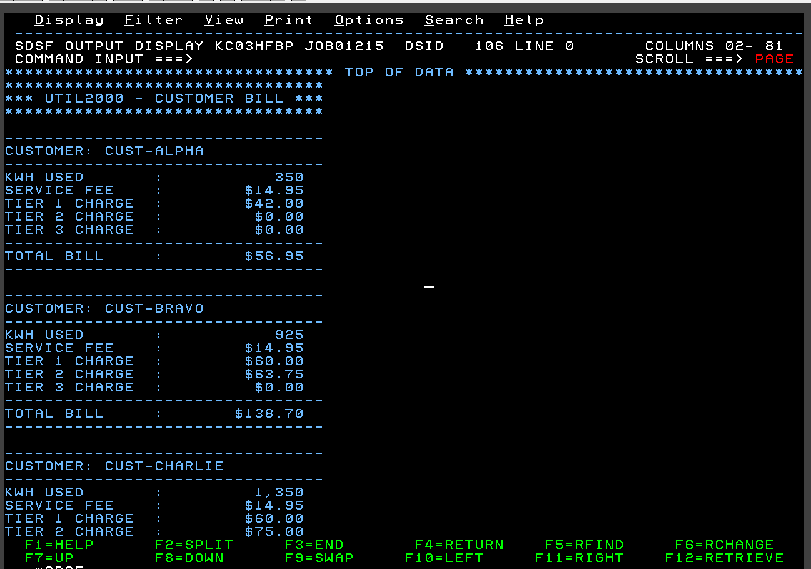
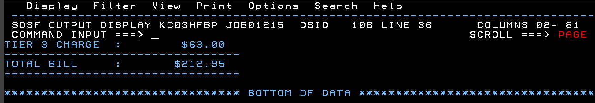

# UTIL2000
## Author
* [Violet French](https://github.com/Pirategirl9000/)

## Table of Contents
* [Author](#author)
* [Purpose](#purpose)
* [Script Breakdown](#script-breakdown)
* [Output](#output)
* [Credits](#credits)

## Output

---

## Purpose
This program uses three predefined users and calculates their electricity bill based on their kWh usage then displays it to SYSOUT. For more detailed description refer to the paragraphs outlined in the [Script Breakdown](#script-breakdown)

## Script Breakdown
### Data Items
* Constants
  * Various fields whose values don't change throughout the program
  * `WS-RATE-TIER1`  - The amount charged for a tier 1 kWh usage
  * `WS-RATE-TIER2`  - The amount charged for a tier 2 kWh usage
  * `WS-RATE-TIER3`  - The amount charged for a tier 3 kWh usage
  * `WS-TIER1-LIMIT` - The amount of kWH for what is considered a tier 1 usage
  * `WS-TIER2-LIMIT` - The amount of kWh bigger than the tier 1 limit before it's considered tier 3 usage

* Predefined Customers
  * `WS-CUST1`, `WS-CUST2`, `WS-CUST3`
    * Stores information related to each customer
    * Data Items ('#' indicates the customer's number)
      * `WS-C#-NAME` - The name of the customer
      * `WS-C#-KWH`  - The total kWh the person used
      * `WS-C#-FEE`  - The service fee for this customer
* Current Input fields
  * Store the information of the current customer whose values we are calculating
  * We do it this way so that the paragraphs can achieve a degree of polymorphism
  * Data Items
    * `WS-CUST-NAME`   - Stores the name of the customer
    * `WS-KWH-USED`    - Stores the kWh
    * `WS-SERVICE-FEE` - Stores the service fee
* Work Areas
  * These are different items used to store the results of the calculations
  * Data Items
    * `WS-TIER1-KWH`    - The first 500 kWh used by the customer priced at $0.12/kWh
    * `WS-TIER2-KWH`    - Next 500 kWh used by the customer priced at $0.15/kWh
    * `WS-TIER3-KWH`    - Any kWH beyond the first 1000 at priced at $0.18/kWh
   
    * `WS-TIER1-CHARGE` - The amount being charged as tier 1 rates 
    * `WS-TIER2-CHARGE` - The amount being charged as tier 2 rates
    * `WS-TIER3-CHARGE` - The amount being charged as tier 3 rates
 
    * `WS-SUBTOTAL`     - The subtotal to this customer (charges without the service fee)
    * `WS-TOTAL-BILL`   - The total charged to this customer (charges with service fee)
* Formatted Fields
  * These items are used for outputting the different values in a formatted way by moving calculated items to here
  * Data Items
    * `WS-KWH-USED-ED` - The kWh used formatted
    * `WS-MONEY-ED`    - Used for displaying the service fee and the different tiers of charges formatted
    * `WS-MONEY-ED2`   - Used for displaying the total bill formatted
### Paragraphs
* `000-MAIN`
  * Serves as the main entry point for the program
  * Steps
    1. Displays the bill header
    2. Loads a customer's data using the respective paragraph
    3. Performs 600-RUN-BILL to delegate the calculations and output elsewhere
    4. Repeats steps b & c until there are no more customers
* Customer Load Paragraphs
  * `500-LOAD-CUST1`, `510-LOAD-CUST2`, `520-LOAD-CUST3`
  * These paragraphs load each respective customer into the current input fields to allow for calculations to be done
  * Data Loaded ('#' indicates the customer's number)
    * `WS-C#-NAME` -> `WS-CUST-NAME`
    * `WS-C#-KWH`  -> `WS-KWH-USED`
    * `WS-C#-FEE`  -> `WS-SERVICE-FEE`
* `600-RUN-BILL`
  * Delegates the work of creating the bill to different paragraphs
  * Different Paragraphs Performed
    * `100-INITIALIZE`      - Sets all work area data items to 0
    * `200-CALC-TIERS`      - Calculates the kWh used in each tier
    * `300-CALC-CHARGES`    - Calculates the charges based on the kWh used in each tier
    * `400-DISPLAY-RESULTS` - Display the results of the calculations
* `100-INITIALIZE`
  * Sets all the data items used for work calculations to 0 to get things ready for calculation
  * Items set to zero
    * `WS-TIER1-KWH`
    * `WS-TIER2-KWH`
    * `WS-TIER3-KWH`
    * `WS-TIER1-CHARGE`
    * `WS-TIER2-CHARGE`
    * `WS-TIER3-CHARGE`
    * `WS-SUBTOTAL`
    * `WS-TOTAL-BILL`
* `200-CALC-TIERS`
  * Calculates the total kWh used in each tier, different tiers get charged a different amount per kWh
  * Tiers
    * Tier 1: 0-500
    * Tier 2: 500-1000
    * Tier 3: 1000+
  * Stores the results of these calculations to `WS-TIER#-KWH` ('#' denotes the tier number)
* `300-CALC-CHARGES`
  * Calculates the amount charged per tier, the subtotal, and the total
    * Calculating the amount charged for each tier where t=tier number
      * $Charge_t  \approx kWh_t * Rate_t$
      * $Subtotal = Charge_1 + ... + Charge_n$
      * $Total = Subtotal + ServiceFee$
* `400-DISPLAY-RESULTS`
  * Displays the results of the calculations using the formatted fields by moving each calculated value to a formatted data item
  * Display the customer name, kWh used, service fee, each tier's charge, and the total bill (assessed with the service fee included)
  * [View Example Output](#output)

## Credits
This script was an adaptation of a script provided by [Debbie Johnson](https://github.com/dejohns2)
